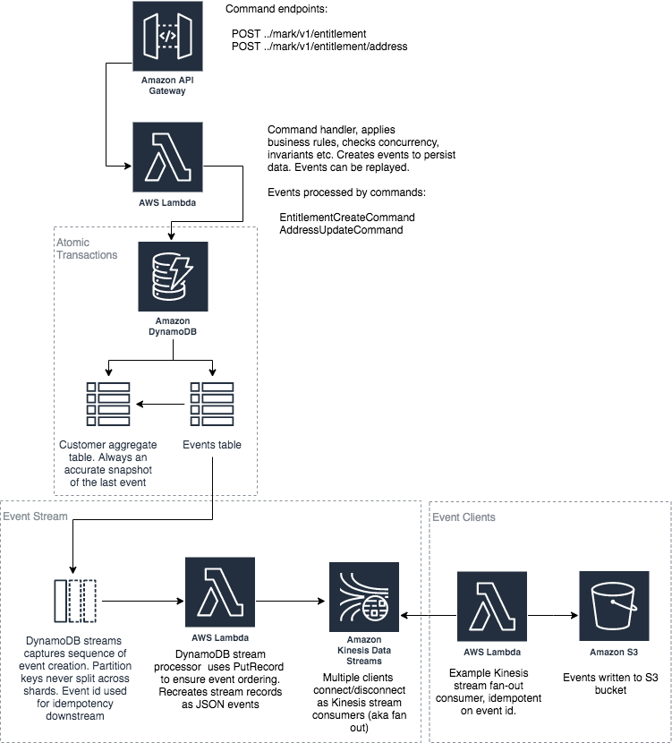

# mark-api



The applications depicted above, mark-api, mark-event-stream and mark-event-queue, are intended as a strawman to demonstrate the benefits of a light-weight, purely serverless event sourcing system. Event sourcing stores every state change to the application as an event object. These event objects are stored in the sequence they were applied for the lifetime of the application.

This mark-api application has a 2 alternative companion applications (pick one), [mark-event-stream](https://github.com/simon-cutts/mark-event-stream) and [mark-event-queue](https://github.com/simon-cutts/mark-event-queue). The mark-api app is a microservice managing marks; mark-event-stream are mark-event-queue are different variant applications, consuming the events produced from mark-api.

Serverless was chosen to simplify the infrastructure with minimal dev ops; but, just as importantly, to use native cloud services rather than rely non-trivial specialist event sourced application frameworks. 

This application adopts the core principle of event sourcing in that all changes to domain objects are done as a result of an event. Consequently, this straw man follows the key idioms of event sourcing: commands, immutable events, event streams, events as the system of record and the ability to replay the event stream to a point in time to get different states of a mark.

The application perhaps deviates from a pure event sourcing pattern in these areas:

1. No separate read and write models (i.e. no [CQRS](https://martinfowler.com/bliki/CQRS.html)). The view of the mark is always up to date so events do not necessarily need to be re-played; consequentially, there is no eventual consistency lag. Of course, being event sourced, events can still be replayed at anytime, if desired
2. The app supports transactional concurrency, with an optimistic locking strategy
2. Allows deletes, so in accordance with [GDPR](https://gdpr-info.eu/art-17-gdpr/), marks can be forgotten

## System of Record

The `RegistrationNumberEvent` table stores every single event that is submitted to the system. This is the immutable system of record for the application.

The `RegistrationNumber` table is the materialized view of the system of record, for quick access by the application. This is not the system of record, merely a view of the system of record. 

The mark can be retrieved from either the materialized view held in the `RegistrationNumber` table or rebuilt directly from the event stream held in the `RegistrationNumberEvent` table

Both the `RegistrationNumberEvent` and `RegistrationNumber` table are persisted in one atomic transaction, with [Amazon DynamoDB Transactions](https://docs.aws.amazon.com/amazondynamodb/latest/developerguide/transactions.html), so that data updates are always consistent across both tables  

### Event Stream
There are 2 alternate event streams

#### 1. mark-event-stream

Events traverse the event stream to notify downstream clients. The event stream is a combination of mark-api and mark-event-stream; its transactional and comprises:

1. From mark-api, a DynamoDB stream from the `RegistrationNumberEvent` table, emits transactional, reliable, time ordered sequence of events. Events remain in `RegistrationNumberEvent` for the lifetime of the mark-api application 
2. The `DynamoDbStreamProcessor` lambda in the mark-event-stream app picks data off the DynamoDB stream and reassembles it into a JSON representation of the event. This event is then written to the  `KinesisStream` within mark-event.
3. The `KinesisStream` from mark-event maintains the same time ordered sequence of events that can be fanned out to multiple interested clients
4. The `KinesisStreamS3Processor` lambda within mark-event is an example of a HTTP/2 Kinesis client using [enhanced fan-out](https://docs.aws.amazon.com/streams/latest/dev/introduction-to-enhanced-consumers.html) to read from the stream. It writes the events to S3. Multiple other enhanced fan-out Lambdas could also access the same stream, acting independently of each other, maintaining their own transactional view of the stream 

#### 2. mark-event-queue

Events traverse the event stream to notify downstream clients. The event stream is a combination of mark-api and mark-event-queue; its transactional and comprises:

1. From mark-api, a DynamoDB stream from the `RegistrationNumberEvent` table, emits transactional, reliable, time ordered sequence of events. Events remain in `RegistrationNumberEvent` for the lifetime of the mark-api application 
2. The ``Lambda DB stream to json converter`` lambda in the mark-event-queue app picks data off the DynamoDB stream and reassembles it into a JSON representation of the event. This event is then written to the  `SQS FIFO Fan out` queue within mark-event-queue.
3. The `SQS FIFO Fanout` queue within mark-event-queue maintains the same time ordered sequence of events that can be fanned out to multiple interested clients
4. The `Lambda Fan out` lambda within mark-event-queue distributes the message events from `SQS FIFO Fanout` queue to all interested `SQS FIFO Client` destinations

## Installation
The application can be deployed in an AWS account using either [Serverless Application Model (SAM)](https://github.com/awslabs/serverless-application-model) or [serverless fraamework](https://serverless.com/)

Either approach requires [Maven](https://maven.apache.org/) installed on your computer. Once installed, from the shell, navigate to the root folder of the app and use maven to build a deployable jar. 
 ```
 $ mvn clean package
 ```
This command should generate a `mark-api.jar` in the `target` folder. Now that we have generated the jar file, we can use either serverless or SAM to package and the deploy to AWS. 

### Serverless Framework
If not already, install the serverless framework [installation guide](https://serverless.com/framework/docs/getting-started/). When complete, having first built the application with maven, from the root folder of the app type

 ```
 $ serverless deploy
 ```

Once the app is deployed, the following should appear

    Serverless: Stack update finished...
    Service Information
    service: mark-api
    stage: dev
    region: eu-west-2
    stack: mark-api-dev
    resources: 20
    api keys:
      None
    endpoints:
      ANY - https://xxxxxxxx.execute-api.eu-west-2.amazonaws.com/dev/{proxy+}
    functions:
      MarkApiAppFunction: mark-api-dev-MarkApiAppFunction
    layers:
      None

#### Run
For an example of the REST operations supported by mark-api, please import the file `mark-api.postman_collection.json` into [Postman](https://www.getpostman.com/). But here are a couple of those GET operations to run in a browser

Purchase a mark. This will only work once. To send another POST, change the value of "mark:"

```
$ curl -H "Content-Type: application/json" -X POST https://xxxxxxxxxx.execute-api.eu-west-2.amazonaws.com/dev/mark/v1/entitlement -d '
  {
    "mark": "AFCF0090",
    "status": "MARK_ASSIGNED",
    "eventTime": "2019-11-29T09:26:43.837Z",
    "price": 299,
    "entitlement": {
      "certificateNo": "EV56RP259VQP8G423H65",
      "nomineeName": "Mr John Jones",
      "certificateTime": "2019-11-29T09:26:43.786Z",
      "purchaserName": "Felicity Jones",
      "address": {
        "addLine1": "2 My Street",
        "addLine2": "Redwood",
        "postTown": "Swansea",
        "postcode": "SW1 4RT"
      }
    }
  }'

```
Get all events for a mark:

```
$ curl https://xxxxxxxxxx.execute-api.eu-west-2.amazonaws.com/dev/mark/v1/event/registrationNumber/AFC0090

```
List all marks:

```
$ curl https://xxxxxxxxxx.execute-api.eu-west-2.amazonaws.com/dev/mark/v1

```

Delete a mark. 

```
$ curl -X DELETE https://xxxxxxxxxx.execute-api.eu-west-2.amazonaws.com/dev/mark/v1/registrationNumber/AFC0090

```
Get mark/entitlement details:

```
$ curl https://xxxxxxxxxx.execute-api.eu-west-2.amazonaws.com/dev/mark/v1/registrationNumber/AFC0090

```

### SAM
SAM requires an S3 bucket to store the artifacts for deployment. Once you have created the deployment S3 bucket, run the following command from the app root folder:

```
$ sam package --output-template-file packaged.yml --s3-bucket <YOUR DEPLOYMENT S3 BUCKET NAME>

Uploading to xxxxxxxxxxxxxxxxxxxxxxxxxx  6464692 / 6464692.0  (100.00%)
Successfully packaged artifacts and wrote output template to file output-template.yaml.
Execute the following command to deploy the packaged template
aws cloudformation deploy --template-file /your/path/output-template.yml --stack-name <YOUR STACK NAME>
```

You can now use the cli to deploy the application. Choose a stack name and run the `sam deploy` command.
 
```
$ sam deploy --template-file ./packaged.yml --stack-name <YOUR STACK NAME> --capabilities CAPABILITY_IAM
```

Once the application is deployed, you can describe the stack to show the API endpoint and the DynamoDB stream the that was created

```
$ aws cloudformation describe-stacks --stack-name <YOUR STACK NAME>
{
    "Stacks": [
        {
            "StackId": "arn:aws:cloudformation:eu-west-2:022099488461:stack/mark-api/481ca360-151e-11ea-a1f3-0ab68d74e79c",
            "StackName": "mark-api",
            "ChangeSetId": "arn:aws:cloudformation:eu-west-2:022099488461:changeSet/awscli-cloudformation-package-deploy-1575303038/b86abb1b-0003-4ba7-aa7d-49b5c6543064",
            "Description": "AWS MarkApiApp API - mark-api::mark-api",
            "CreationTime": "2019-12-02T16:10:39.149Z",
            "LastUpdatedTime": "2019-12-02T16:10:44.442Z",
            "RollbackConfiguration": {},
            "StackStatus": "CREATE_COMPLETE",
            "DisableRollback": false,
            "NotificationARNs": [],
            "Capabilities": [
                "CAPABILITY_IAM"
            ],
            "Outputs": [
                {
                    "OutputKey": "RegistrationNumberEventDynamoDBTable",
                    "OutputValue": "arn:aws:dynamodb:eu-west-2:xxxxxxxxx:table/RegistrationNumberEvent/stream/2019-12-02T16:10:47.159",
                    "Description": "DynamoDB Events table ARN",
                    "ExportName": "DynamoDBStreamArn"
                },
                {
                    "OutputKey": "MarkApiApp",
                    "OutputValue": "https://xxxxxxxx.execute-api.eu-west-2.amazonaws.com/Prod",
                    "Description": "URL for application",
                    "ExportName": "MarkApiApp"
                }
            ],
            "Tags": [],
            "EnableTerminationProtection": false,
            "DriftInformation": {
                "StackDriftStatus": "NOT_CHECKED"
            }
        }
    ]
}
```

If any errors were encountered, examine the stack events to diagnose the issue

```
$ aws cloudformation describe-stack-events --stack-name <YOUR STACK NAME>
```

At any time, you may delete the stack

```
$ aws cloudformation delete-stack --stack-name <YOUR STACK NAME>
```

#### Run
For an example of the REST operations supported by mark-api, please import the file `mark-api.postman_collection.json` into [Postman](https://www.getpostman.com/). But here are a couple of those GET operations to run in a browser

List all marks:

```
$ curl https://xxxxxxxxxx.execute-api.eu-west-2.amazonaws.com/Prod/mark/v1

```
Purchase a mark. This will only work once. To send another POST, change the value of "mark:"

```
$ curl -H "Content-Type: application/json" -X POST https://xxxxxxxxxx.execute-api.eu-west-2.amazonaws.com/Prod/mark/v1/entitlement -d '
  {
    "mark": "AFCF0090",
    "status": "MARK_ASSIGNED",
    "eventTime": "2019-11-29T09:26:43.837Z",
    "price": 299,
    "entitlement": {
      "certificateNo": "EV56RP259VQP8G423H65",
      "nomineeName": "Mr John Jones",
      "certificateTime": "2019-11-29T09:26:43.786Z",
      "purchaserName": "Felicity Jones",
      "address": {
        "addLine1": "2 My Street",
        "addLine2": "Redwood",
        "postTown": "Swansea",
        "postcode": "SW1 4RT"
      }
    }
  }'

```
Get all events for a mark:

```
$ curl https://xxxxxxxxxx.execute-api.eu-west-2.amazonaws.com/Prod/mark/v1/event/registrationNumber/AFC0090

```

Delete a mark. 

```
$ curl -X DELETE https://xxxxxxxxxx.execute-api.eu-west-2.amazonaws.com/Prod/mark/v1/registrationNumber/AFC0090

```
Get mark/entitlement details:

```
$ curl https://xxxxxxxxxx.execute-api.eu-west-2.amazonaws.com/Prod/mark/v1/registrationNumber/AFC0090

```

List all marks mark:

```
$ curl https://xxxxxxxxxx.execute-api.eu-west-2.amazonaws.com/Prod/mark/v1

```
